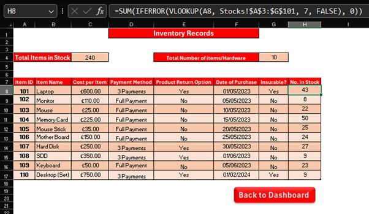
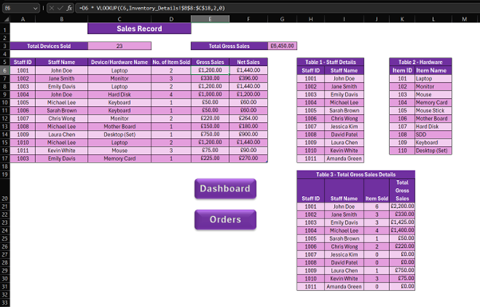
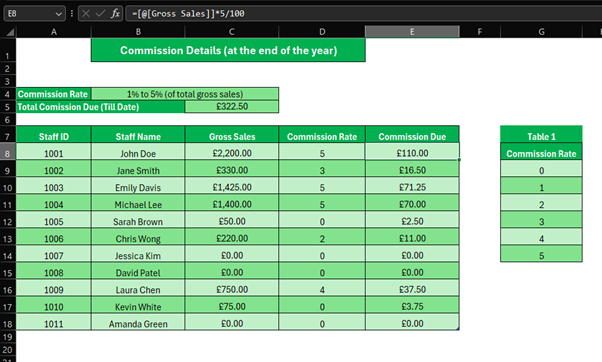

# 📊 Excel Inventory & Sales App

This Excel-based application was developed as part of a BTEC Level 3 IT assignment to model inventory and sales processes for a fictional tech hardware company. It includes linked sheets, automation formulas, and a commission calculator.

## 📌 Features

- Inventory tracking for hardware products using lookup tables
- Automated sales report with SUM and VLOOKUP formulas
- Commission calculator for sales staff with dynamic value adjustment
- Interactive navigation buttons between worksheets
- Clean, colour-coded layout with basic error handling and totals

## 🛠️ Tools & Technologies Used

- Microsoft Excel (Formulas: `SUM`, `VLOOKUP`, conditional formatting)
- Custom navigation using form controls/buttons
- Data validation for dropdown menus
- Structured multi-sheet workbook

## 📸 Screenshots

## 📁 Notes

This project was built for the **Data Modelling** unit in the BTEC Level 3 IT course (2022–2024). It demonstrates how spreadsheets can be used to simulate business processes with accuracy and automation.
